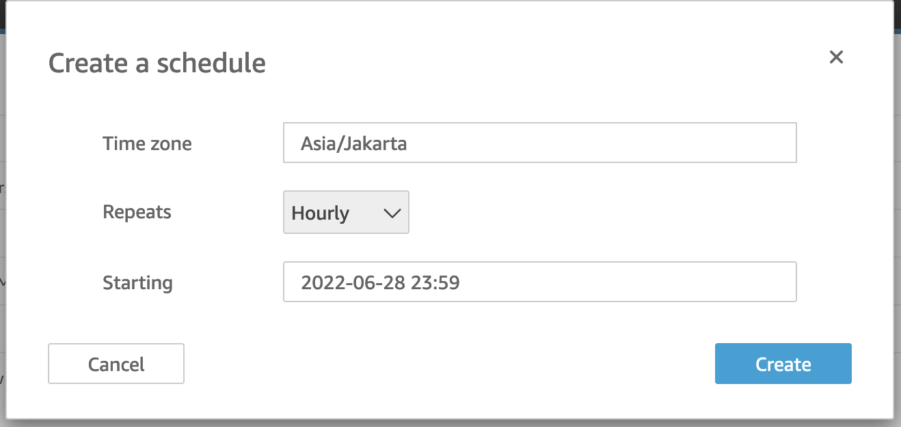

# GSheet to Quicksights Data Source

## Program Flow:

## Prerequisites:
1. Setup AWS AccessKey and SecretKey that enable access to read and write to specific S3 Bucket.

## Steps:
1. Navigate to Apps Script on the Google Spreadsheet.

2. Copy all the code that was given in this repo, you can see the final configuration below.

3. Navigate to the project settings.

4. Add the AccessKeyId, Bucket Name, and Secret AccessKey to the script properties. This will protect your secrets for security reason.

5. Navigate to Triggers

6. This is the trigger implementation you can make the program to sync on the given time, such as sync every minutes or with other configuration.

7. It will export every worksheet on the workbook into a different csv file on the bucket.

8. In Quicksight we can make our S3 Bucket as our data source.

9. This is how our manifest.json file looks like and needs to be uploaded.

10. We can also preview the data here.

11. We also schedule a job to refresh our dataset hourly.

