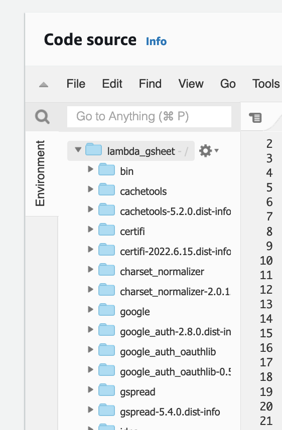

# Append CSV file on S3 to Gsheet Worksheet

## Prerequisites:
1. Setup Service Account in GCP.

## Steps:
1. Share your spreadsheet with the service account email.

2. Copy the spreadsheetId the Id is the one that I select for example

3. Add the service account private key to key.json file on lambda_function directory
4. Zip the lambda_function directory
5. Upload the zip to lambda and Add the spreadsheetId that you copy to the environment variable

6. Make sure the directory looks like this with lambda_function.py in the root directory

7. Add Trigger to the Lambda from specific s3 bucket and don't forget to set the object format .csv

8. The flow of the program looks like this:
- When there is a object create event, it will invoke the lambda function to make a new worksheet with the title of the filename of the csv file in this example address, if there is address workbook available it will clear all the cell within the sheet and replace it with the new one as seen at the last image

## PS. Just make sure in the configuration runtime at minimum 30 seconds instead of 3 seconds. And make sure the lambda role has access to List and Get Object at the bucket
